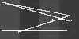
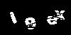
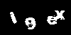
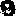

Puzzle 5
========

You made it; it's the final puzzle and it's all about CAPTCHAs. The basic premise of this task is that you will need to solve CAPTCHAs. In fact, you will need to solve at least 10,000 of them in order to pass. This puzzle is unlike the others in the sense that the goal is not hidden, but it is hard in the sense that there is no set way to do this problem. So below I will provide a brief overview of some of the techniques we know about that have worked.

| Technique   | Comments                                                                                                                |
|-------------|-------------------------------------------------------------------------------------------------------------------------|
| Brute Force | For the masochists. The contest is over, it's not worth it anymore.                                                     |
| Reverse Engineering (Hashing)     | A quick solution if you can find it, but not too satisfying in my opinion.                                              |
| OCR         | [Tesseract](https://github.com/tesseract-ocr/) is good at this, but it requires a lot of work to achieve good accuracy. |
| CNN         | Convolutional Neural Networks. This is it what we use in our solution below.                                            |

Part I - Initial Steps
----------------------

First things first, we have to download a lot of CAPTCHAs. This is pretty easy with cURL: `for i in {1..32}; do curl -o "images.$i.json" https://captcha.delorean.codes/u/<username>/challenge; done`. You can download the files from [captcha.delorean.codes/u/\<username>/challenge](https://captcha.delorean.codes/u/<username>/challenge) (again, they are different by user so make sure to replace the username field). The files contain 1,000 CAPTCHAs with each having a name/image pair like below.

```
{"name":"daaa8540ef311fa3452e8863c206929d","jpg_base64":"..."}
```

The images are base64-encoded JPGs. You can easily convert these to files with your programming language of choice, in node.js for example:

```
const imgs = JSON.parse(fs.readFileSync('images.1.json')).images;
imgs.forEach(i => {
    fs.writeFileSync('imgs/' + i.name + '.jpg', new Buffer(i.jpg_base64, 'base64'));
});
```

This is an example of what one of my CAPTCHAs looks like:


Once you download a bunch of these CAPTCHAs, you enter the painful part. At one point during the competition we knew that if there were only 10 slots left we would have to do all 10,000 by hand. Since we didn't know what to do yet, we wrote a quick app and started solving them by hand. It turns out that this was extremely useful training data for the convolutional neural network later. We each did 1,000 over the course of an hour, but only used one of those sets to actually train. I have saved you the trouble by including our training data ([solutions.json](solutions.json)).

Part II - Preprocessing
-----------------------

This is where things start to get hectic. I tend to prefer Java for speed and also comfort, so I started writing my preprocessor in Java, but then used Python to do the machine learning. Hence, there will be some transfer back and forth between languages and passing of files.

### Section A - Cleaning

The first thing you might notice is that all the CAPTCHAs have the same background image which consists of 4 colored strips and also, annoyingly, a few white lines. So, we want to remove all of this from each captcha. What's annoying about the white lines is that removing them cuts into the characters in strange ways, but if you don't remove them they remain hard to read.

The first thing I did was convert the color images to grayscale. After making the images grayscale it is a lot easier to deal with them as the color does not affect the results in any way. Next, we want to calculate the background mask. We can do this in a few ways, but I choose to calculate the mode color of each pixel which turned out to work pretty well. The mode pixel will be the one that appears most commonly in all the images, in other words, the background.



So now we have the background. What's remaining is to remove the background and fix the places where the lines intersected the characters. We want a binary image, i.e. just 0 and 255. The first part is easy; we can simply subtract the background from the image.



Next, in order to add back pieces of the white lines, we go through the entire image and for each pixel we count how many nearby pixels are also white. Then if a pixel was originally removed as background *and* it was part of a white line *and* it has enough nearby pixels, we add it back to the image. This is essentially [dilation.](https://homepages.inf.ed.ac.uk/rbf/HIPR2/dilate.htm)

What results is one of the cleaner outcomes we have seen.



### Section B - Character Seperation

Although it would be possible to train the convolutional neural network with entire CAPTCHAs, learning would be slow and we would need much more data; however, if we instead parse each image into individual characters, we could train the network much faster.

Since our images are relatively clean, we can apply a relatively simple character seperation algorithm. All we have to do is sweep the image from left to right; when we encounter a white pixel we begin a new character and continue this character until we encounter a line with all black pixels. During this sweep we also keep track of the highest and lowest pixels. Next we have seperated the characters; however, some of them still are a bit weird, especially when two characters touch each other. In order to solve this we only use the CAPTCHAs that the algorithm identifies as having 4 characters that each fit into a 25 by 25 pixel box. This way we have a uniform shape to feed into the network.





*It wasn't possible to separate the characters 100% of the time.*


*We just threw out the ones that didn't have four segments.*

Part III - Convolutional Neural Networks
----------------------------------------

Now we get to the fun part. We need to make a [Convolutional Neural Network](https://en.wikipedia.org/wiki/Convolutional_neural_network) which will label each extracted character. It turns out that a textbook CNN will do here; we didn't do any tuning and it was able to train within 2-3 minutes on the CPU of a 12" MacBook (surprising?). If you haven't used Keras before I would highly recommend checking it out. It makes this next step so easy. Using Keras I made the following model:

```python
model = Sequential()

model.add(Conv2D(32, (3,3), input_shape=(25,25,1)))
model.add(Activation('relu'))
model.add(MaxPooling2D(pool_size=(2,2)))

model.add(Conv2D(32, (3,3)))
model.add(Activation('relu'))
model.add(MaxPooling2D(pool_size=(2,2)))

model.add(Conv2D(64, (3,3)))
model.add(Activation('relu'))
model.add(MaxPooling2D(pool_size=(2,2)))

model.add(Flatten())
model.add(Dense(64))
model.add(Activation('relu'))
model.add(Dropout(0.5))
model.add(Dense(36))
model.add(Activation('sigmoid'))
```

A basic CNN involves a **convolution layer** followed by an **activation layer** which typically uses **ReLU** ([Rectified Linear Unit](https://en.wikipedia.org/wiki/Rectifier_(neural_networks)) and finally a **pooling layer**. We use this structure three times followed by a **dense layer** (or normal neural network layer).

We then needed to export two files (in Java). We wanted one file to contain the training data, which will be a map of character image data to its label, and another file to contain the testing data, which will be characters mapped to the name of the CAPTCHA they belong to. We converted the data into a 25 by 25 boolean array in order to make it easier to train on and export.

Since our naive algorithm only accepts about half the data (segmentation issues), we downloaded about 30,000 CAPTCHAs just to be safe. Then we can pass it in and generate our testing data. After that, we're pretty much done. We just train the network on the training data then run the testing data through it and output a solution file. See [cnn.py](cnn.py).

That's it! You're all done. Just upload the solution file to their endpoint with cURL or something else and you'll get the magic time.

Thanks for reading!
